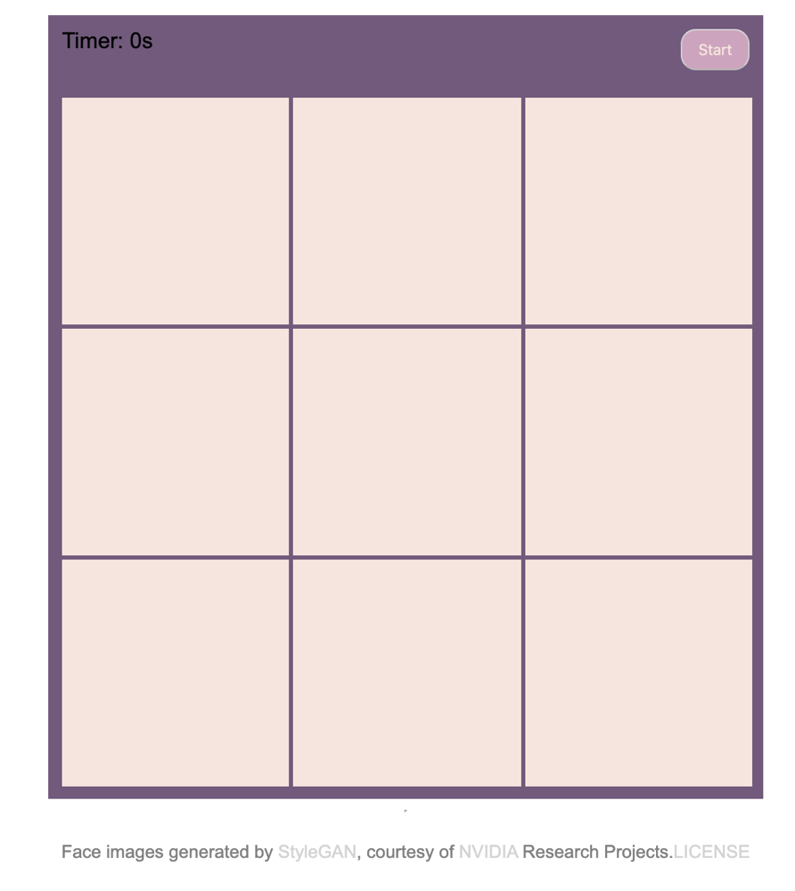
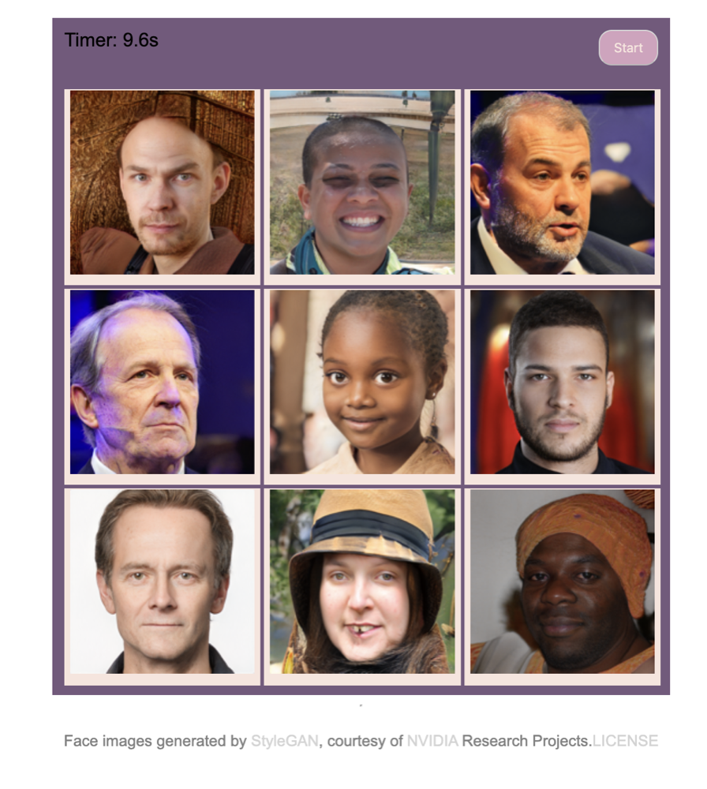
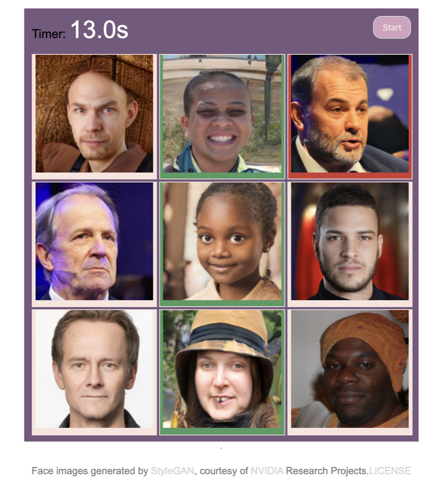

# ReadMyFace
Here is live link: [ReadMyFace](https://readface.herokuapp.com/)

## How to play?
This is a facial expression game

* User will try to find happy faces.
* After clicking start button, timer will start and faces will reveal.
* User click the faces which they think they are 'happy'. 
* If answer is true, bacground will turn green, if not it will become red.
* After finding all happy faces timer will stop. (There is no time limitation.)

This project made by using JavaScript, HTML and CSS. 
Used pure DOM API to implamnet the game logic. No database or backend service used because images are served statically. 

Each image had ~2.5MB size. For resizing after going in the file images in 
```
sips -Z 165 *.png
```
command line used. (165 is the image box dimention.)


Opening page will be close image boxes and timer at 0s.




For checking if user cliked right image box or not this function is used in Game class. 

```    
    userClicked(e) {
        let img = e.target;
        let box = img.parentElement;
        let imgName = img.src.split('/').pop();
        
        //check if it is  right face
        if (this.happyFaces.includes(imgName)){
            box.style.backgroundColor = 'rgb(80, 155, 97)';
            this.rightFace+=1
        } else {
            box.style.backgroundColor = 'rgb(206, 62, 51)';
        };
    };
```

After faces revaled user can click their answers.



After finding all right answers timer will stop. Wrong faces going to have red backgroung.




### TO DO List for future;

* Start button css
* backgorund color for whole page
* timer color css
* game panel css 